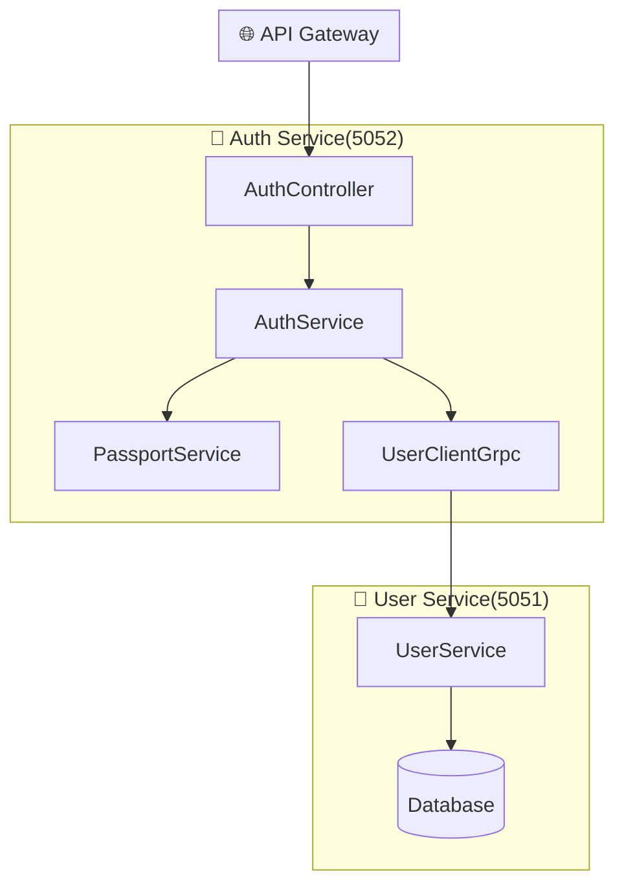
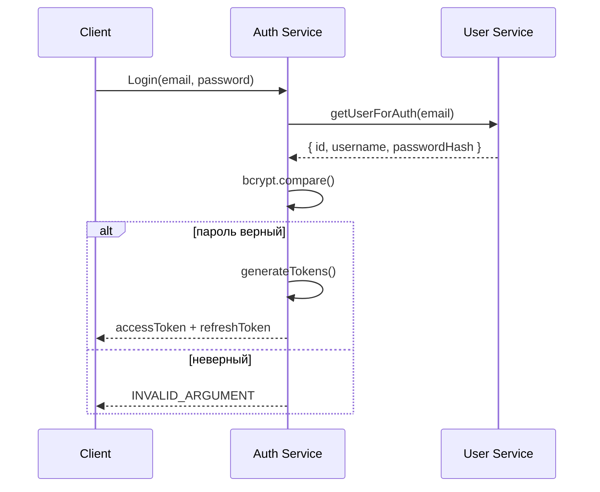
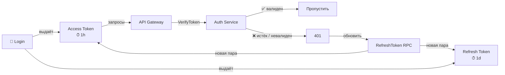

# Auth Service 🔐

Микросервис аутентификации платформы **VoiceChat**. Регистрация, вход, выпуск JWT (access + refresh), верификация и ротация токенов. Общается по gRPC.

---

## Как устроен

```mermaid
flowchart TB
    subgraph GW["🌐 API Gateway"]
        direction LR
    end

    subgraph Auth["🔐 Auth Service(5052)"]
        AC["AuthController"]
        AS["AuthService"]
        PS["PassportService"]
        UG["UserClientGrpc"]
    end

    subgraph User["👤 User Service(5051)"]
        US["UserService"]
        DB[("Database")]
    end

    GW --> AC
    AC --> AS
    AS --> PS
    AS --> UG
    UG --> US
    US --> DB
```

```mermaid
sequenceDiagram
    participant Client
    participant Auth as Auth Service
    participant User as User Service

    Client->>Auth: Login(email, password)
    Auth->>User: getUserForAuth(email)
    User-->>Auth: { id, username, passwordHash }
    Auth->>Auth: bcrypt.compare()
    alt пароль верный
        Auth->>Auth: generateTokens()
        Auth-->>Client: accessToken + refreshToken
    else неверный
        Auth-->>Client: INVALID_ARGUMENT
    end
```

```mermaid
flowchart LR
    Login["🔑 Login"] -->|"выдаёт"| AT["Access Token\n⏱ 1h"]
    Login -->|"выдаёт"| RT["Refresh Token\n⏱ 1d"]

    AT -->|"запросы"| API["API Gateway"]
    API -->|"VerifyToken"| Auth["Auth Service"]
    Auth -->|"✅ валиден"| OK["Пропустить"]
    Auth -->|"❌ истёк / невалиден"| Deny["401"]

    Deny -->|"обновить"| Refresh["RefreshToken RPC"]
    Refresh -->|"новая пара"| AT
    Refresh -->|"новая пара"| RT
```
